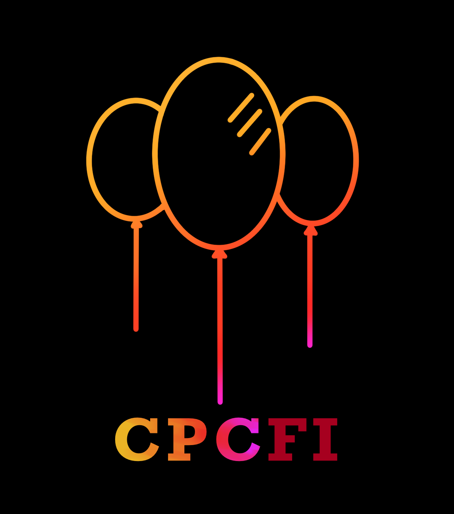
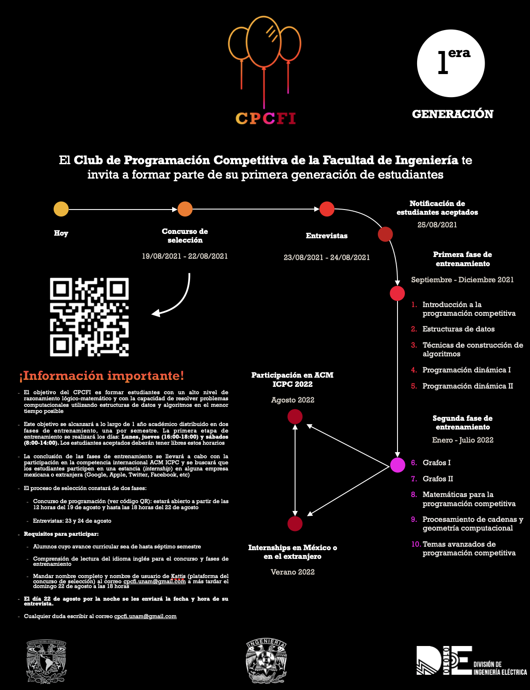

# CPCFI

¡Welcome to CPCFI 👋! ~ UNAM's School of Engineering Competitive Programming Club




We're a bunch of nerds that:

- Spend most of their time solving unsolvable problems :sunglasses:
- Thinking about big numbers :smirk:
- Cursing online judges that throw ```WA```, ```TLE``` or any other verdict that is not <span style="color:green">Accepted</span> :rage:

**No, really, what do we do?**

- Study algorithms and data structures (even a ```double ended queue```) to solve computer programming problems as fast as possible. How fast?
  - Well, about 12-13 problems in 5 hours
  - Check out [this problemset](https://codeforces.com/blog/entry/71296) if you want get an idea
- Solve, solve and solve competitive programming problems
- Wondering why [UVa](https://onlinejudge.org/) shuts down between 20:00-22:00 and thinking of maybe coming back to [Codeforces](https://codeforces.com/)
- ... solve more problems ...
- And, compete at [ACM ICPC](https://icpc.global/), the equivalent of the Super Bowl or FIFA World Cup of competitive programming

## Meet us

Check out this cool photo of our **first generation**

:warning: Still waiting for everyone to agree on a photo in which they don't close their eyes :warning:

--- 
And, here is the list of our **first generation** members: 

|Name|Github :octocat: |Birthday|Zodiac Sign|Owns any crypto?|
|----|------|--------|----------------|-----|


## The Boring Stuff 

Here are the topics we cover (sort of) throughout an entire year: 

1. Introduction to Competitive Programming
2. Data Structures
   - Here we cover our famous ```double ended queue```
   - and even ```Fenwick Tree```
3. Strategies to build algorithms
   - Be ready for some Backtracking
4. Dynamic Programming I
5. Dynamic Programming II
   - Because we can and want :cowboy_hat_face:

At this point, we run our annual **Winter Programming Contest** :snowman_with_snow: and the contest is open for everyone and hopefully, if we can keep down low inflationary rates, winning teams can be awarded some nice prizes :gift:

6. Graphs I
   - How does Dijkstra's algorithm sounds? (because everyone knows DFS and BFS aleady :yawning_face:)
7. Graphs II
   - Or some Ford-Fulkerson? :thinking:
8. Math for Competitive Programming
   - Just so our sisters and brothers from UNAM's School of Science don't get bored
9. String Processing and Computational Geometry
10. Advanced Topics in Competitive Programming
    - Ever heard of the Sprague-Grundy theorem? :zombie: (maybe a really bad reference to this [Batman's supervillain](https://batman.fandom.com/wiki/Solomon_Grundy))

If you hate emojis, check our full syllabus [here]()

## Contact

Feel free to reach out to us if you have any questions, we'll be glad to answer.
Specifically if you have any of the following questions:
    
- Why can't I use brute force for any problem? :weary:
- VSCode, Sublime or vim? :stuck_out_tongue_closed_eyes:
- But please, don't email us if you need help with your homework. Nah, we're just kidding, we could solve your CS homework quite fast if you are willing to spend some BTC :money_with_wings:
- Or, who is John Galt? :flushed:

Email: cpcfi.unam@gmail.com

## New applicants

CPCFI's is constantly looking for new members, if any of the past lines made any sense to you or you meet any of the following criteria: 

1. You are bored at you current university lectures :sleeping:
2. Want to learn about a ```double ended queue``` or a ```Fenwick Tree``` :new_moon_with_face:
3. You have the frustrated dream of becoming a professional soccer player but still want to compete at an international level in [ACM ICPC](https://icpc.global/) representing your university :earth_americas: :earth_africa: :earth_asia:
4. Want to work with meet some of the smartest people :nerd_face: *

We accept new applicants every year (fall semester). Please keep an eye for our new poster with deadlines and details. Here is our latest poster: 




\***Note**: currently :disappointed_relieved:, we can only accept students enrolled at any of the National Autonomous University of Mexico's schools, faculties or institutes and be at most, third year student 

## References
- [Supplementary code](https://sites.google.com/site/stevenhalim/home/material)
